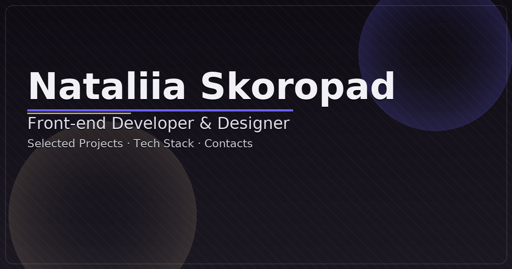

<!-- banner -->
<h2>Hi, I'm Nataliia Skoropad</h2>

  

  Frontend Developer with a background in UX/UI and graphic design.
  Focused on building responsive web applications with React and TypeScript.
  Worked on CRM systems, mobile apps, and corporate websites at Avada Media.
  Combines design thinking with development to create efficient user interfaces.

<!-- DEV & DESIGN STACK -->
<h2>DEV &amp; DESIGN STACK</h2>

<table role="presentation" width="100%" cellspacing="0" cellpadding="0" style="border-collapse:separate;border-spacing:0;">
  <tr>
    <td align="left" valign="top"
        style="padding:0; border-left:2px; border-right:2px; border-top:0; border-bottom:0;">
      

        &nbsp;&nbsp;
        &nbsp;&nbsp;
        &nbsp;&nbsp;
        &nbsp;&nbsp;
        &nbsp;&nbsp;
        &nbsp;&nbsp;
        &nbsp;&nbsp;
        &nbsp;&nbsp;
        &nbsp;&nbsp;
        
      

      

        &nbsp;&nbsp;
        &nbsp;&nbsp;
        &nbsp;&nbsp;
        &nbsp;&nbsp;
        
      

    </td>
    <td align="right" valign="top"
        style="padding:0; border-right:2px; border-top:0; border-bottom:0;">
      
    </td>
  </tr>
</table>

<h2>Featured Projects</h2>
<ul>
  <li>
    

      <a href="https://github.com/Natalia-Skoropad/portfolio-nataliia-skoropad">Portfolio</a> This is a single-page website showcasing my projects and IT work experience, designed for mobile, tablet, and desktop.
Implemented features include: a section with my skills, a list of my projects, a contact form for sending messages, and a convenient contact widget. Technologies used: React · TypeScript · JavaScript · CSS · HTML · Formik · Yup · clsx · modern-normalize · Adobe Photoshop · Figma · Resend · Vite · Vercel
    

  </li>

  <li>
    

      <a href="https://github.com/Natalia-Skoropad/easy-notes">EasyNotes</a> This is a multi-page application that allows users to create, edit, and organize personal notes, designed for mobile, tablet, and desktop. Implemented features include: user registration, authentication, a personal profile with basic user information, and a notes section with the ability to filter notes by categories. Technologies used: Next.js · React · TypeScript · JavaScript · CSS · HTML · axios · cookie · Formic · yup · react-hot-toast · use-debounce · modern-normalize · clsx · lucide-react · zustand · react-paginate · Vercel
    

  </li>

  <li>
    

      <a href="https://github.com/Natalia-Skoropad/sweet_cheese_pancakes_recipe">Sweet Cheese Pancakes Recipe</a> This is a fully responsive, SEO-optimized recipe webpage designed for mobile, tablet, and desktop. The project includes a detailed recipe page with a photo gallery, an ingredient table, step-by-step cooking directions, helpful tips, an author section, and an interactive feedback form with validation. The page also features structured metadata (Open Graph, Twitter Card), a custom favicon, accessibility improvements (ARIA labels, semantic HTML), and optimized images for performance. Technologies used: HTML · CSS (modular) · JavaScript · modern-normalize · adaptive images (picture/srcset) · SVG sprite
    

  </li>

  <li>
    

      <a href="https://github.com/Natalia-Skoropad/planet_fitness_studio">Planet Fitness Studio</a> This is a fully responsive, modern fitness website designed for mobile, tablet, and desktop. Implemented features include a dynamic hero section, adaptive club gallery, membership plans with highlighted offers, program guides, a contact section with an interactive callback form, a custom modal window, and optimized adaptive images (picture/srcset). The project also includes structured metadata (Open Graph, Twitter Card), a custom favicon, accessibility improvements, and smooth UI interactions. Technologies used: HTML · CSS (modular) · JavaScript · modern-normalize · adaptive images (picture/srcset) · SVG sprite
    

  </li>
  
  <li>
    

      <a href="https://github.com/ZViacheslavV/developers-orchestra-project">ArtistsHub</a> This is a group project. My role: Scrum Master Assistant. My contribution to the project was as follows: Developed the “Reviews” section on the website; Added toasts to the site (izitoast); Optimized the icon sprite; Optimized project images; Tested website functionality (PageSpeed Insights, CSS Validation Service, Markup Validation Service); Designed the project presentation in Figma; Supported team members and helped them finalize their sections to meet the deadline. Technologies used:JavaScript · CSS · HTML · axios · css-star-rating · izitoast · swiper · tui-pagination · modern-normalize · Figma · Adobe Photoshop · Vite 
    

  </li>

  <li>
    

      <a href="https://github.com/ZViacheslavV/biological-core-project">YogaBloom</a> This is a group project. My role: Scrum Master. My contribution to the project was as follows: Developed the “Why Yoga Helps You” section on the website; Optimized the icon sprite; Optimized project images; Tested website functionality (PageSpeed Insights, CSS Validation Service, Markup Validation Service); Designed the project presentation in Figma; Organizing online meetings. Technologies used: JavaScript · CSS · HTML · Figma · Adobe Photoshop · Vite
    

  </li>
</ul>

<h2>GitHub Activity Graph</h2>

<h2>Languages & Contacts</h2>

| **Languages**                                                                                                                                                                                                                          | **Contacts**                                                                                                                                                                                                                                                                                                                                                                                                                                                                                                            |
| -------------------------------------------------------------------------------------------------------------------------------------------------------------------------------------------------------------------------------------- | ----------------------------------------------------------------------------------------------------------------------------------------------------------------------------------------------------------------------------------------------------------------------------------------------------------------------------------------------------------------------------------------------------------------------------------------------------------------------------------------------------------------------- |
|   |    |
